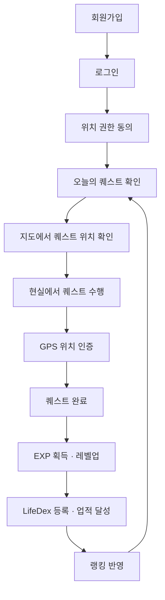

# 01. 프로젝트 기획서

> 원본 기획: `00-original-project-plan.md`
> 관련 문서: `02-screen-spec.md` · `03-database-design.md` · `04-api-spec.md` · `05-business-rules.md` · `06-team-roles.md`

## 1. 프로젝트 개요

| 항목 | 내용 |
|---|---|
| 프로젝트명 | Life Quest |
| 한 줄 소개 | 현실을 게임처럼 즐기고, 경험을 수집하며 성장하는 라이프 RPG 플랫폼 |
| 목적 | 사용자가 현실 속 활동을 게임 퀘스트처럼 수행하며 EXP를 획득하고, 레벨업·도감 수집·업적 달성을 통해 지속적으로 새로운 경험을 하도록 돕는다 |

## 2. 배경과 문제 정의

현대인은 반복되는 일상 속에서 새로운 경험을 시도할 기회가 적고, 기존 습관 관리 앱은 사용자가 직접 목표를 설정하고 반복 체크해야 하므로 흥미를 유지하기 어렵다.

**해결하고자 하는 문제**

- 반복되는 일상으로 인한 새로운 경험 부족
- 새로운 활동을 시작하기 어려움
- 목표를 꾸준히 이어가기 어려움
- 기존 습관 관리 앱의 낮은 지속성
- 단순 체크 방식으로 인한 퀘스트 인증의 신뢰성 부족

→ 현실 속 장소와 행동을 게임 콘텐츠로 제공하고, **GPS 기반 위치 인증**으로 완료의 신뢰성을 높여 실제 경험을 게임처럼 즐길 수 있도록 한다.

## 3. 서비스 목표

- 현실 속 다양한 경험을 게임 콘텐츠로 제공
- 사용자의 지속적인 참여와 동기부여 제공
- 경험을 수집·기록하는 라이프 플랫폼 구축
- 게임 요소로 자기계발을 재미있게 만드는 서비스 구현
- GPS 기반 위치 인증으로 실제 활동과 게임 플레이 연결

## 4. 경쟁 서비스와의 차별점

| 비교 대상 | 한계 | Life Quest의 접근 |
|---|---|---|
| 습관 관리 앱(투두·챌린지형) | 사용자가 직접 목표를 설정·체크해야 해 지속성이 낮음 | 시스템이 매일 새로운 퀘스트를 제안 |
| 단순 체크형 인증 | 자기 신고 방식이라 완료의 신뢰성이 낮음 | GPS 기반 현장 인증으로 완료 신뢰성 확보 |
| 수집형 게이미피케이션 앱 | 현실 활동과 연결되지 않는 경우가 많음 | 현실 장소·행동이 곧 게임 콘텐츠(도감·업적)로 축적 |

## 5. 핵심 컨셉

**현실 속 행동 = 게임 퀘스트.** 사용자는 현실에서 다양한 활동을 수행하며 게임 캐릭터처럼 성장한다.

**퀘스트 예시**: 새로운 카페 방문 · 30분 산책 · 새로운 음식 먹기 · 부모님께 전화 · 공원에서 사진 찍기 · 박물관 방문 · 바다 근처 도착

## 6. 주요 기능 개요

상세 규칙은 `05-business-rules.md`, 데이터 구조는 `03-database-design.md`, API는 `04-api-spec.md` 참조.

| 기능 | 담당 | 한 줄 설명 |
|---|---|---|
| 회원가입·로그인·JWT 인증 | 팀원 1 | 이메일 기반 가입, JWT 발급·검증 |
| 마이페이지·프로필 수정 | 팀원 1 | 사용자 정보 조회·수정, 프로필 이미지 |
| EXP·레벨 시스템 | 팀원 1 | 경험치 누적, 레벨 계산, 레벨업 판정 |
| 레벨업 보상·칭호·프로필 아이템 | 팀원 1 | 레벨업 시 보상 지급, 칭호 선택 |
| 오늘의 퀘스트 제공 | 팀원 2 | 1일 N개 퀘스트 랜덤 배정 |
| 퀘스트 목록·상세·등급 | 팀원 2 | 퀘스트 조회, 등급(일반~전설) 표시 |
| GPS 위치 인증·거리 계산 | 팀원 2 | 현재 위치와 퀘스트 장소 간 거리·반경 판정 |
| 퀘스트 완료 처리 | 팀원 2 | 완료 진입점, 중복 완료 방지(멱등) |
| 지도 기반 퀘스트 탐색 | 팀원 2 | 주변 퀘스트 위치를 지도에 표시 |
| 경험 도감(LifeDex) | 팀원 3 | 완료한 장소·활동을 카테고리별로 수집 |
| 업적 시스템(단계별·비밀 업적) | 팀원 3 | 조건 달성 시 업적 부여, 비밀 업적 해금 |
| 친구(검색·추가·목록·비교) | 팀원 4 | 친구 관계 관리, 활동 기록 비교 |
| 랭킹(EXP·레벨) | 팀원 4 | 전체·친구 랭킹 제공 |
| 관리자 퀘스트 관리 | 팀원 4 | 퀘스트 등록·수정·삭제 |

## 7. 서비스 이용 흐름

위치 인증이 필요 없는 행동형 퀘스트(독서, 전화 등)는 사용자의 직접 완료 처리로 진행한다. 상세: `05-business-rules.md` §4.

## 8. MVP 범위

### 8-1. 필수 구현 기능

- 회원가입·로그인·JWT 인증
- 오늘의 퀘스트 제공, 일반/위치 기반 퀘스트 구분
- 사용자 현재 위치 조회, GPS 기반 퀘스트 인증
- 퀘스트 장소-사용자 위치 간 거리 계산, 인증 반경 판정
- 지도에 현재 위치·퀘스트 위치 표시
- 퀘스트 완료 및 EXP 지급(멱등 보장)
- 레벨 시스템, 레벨업 보상
- 경험 도감(LifeDex)
- 기본 업적 시스템
- 친구·EXP 랭킹
- 마이페이지
- 완료·인증 기록 관리

### 8-2. 핵심 MVP 우선순위(팀원별)

| 팀원 | 최우선 구현 항목 |
|---|---|
| 팀원 1 | 로그인, 마이페이지, EXP, 레벨 |
| 팀원 2 | 오늘의 퀘스트, GPS 인증, 퀘스트 완료 |
| 팀원 3 | LifeDex, 기본 업적 |
| 팀원 4 | 친구 목록, EXP 랭킹, 관리자 퀘스트 등록 |

### 8-3. MVP 위치 인증 범위

- 관리자가 미리 등록한 장소를 기준으로 퀘스트 제공(위도·경도 저장)
- 사용자 현재 위치와 퀘스트 장소 간 거리 계산 후, 인증 반경 이내인 경우에만 완료 처리
- 지도 API로 장소·현재 위치 표시

실시간 이동 경로 추적, 정교한 위치 조작 탐지 등 고급 기능은 Phase 2로 분리한다. 상세 규칙: `05-business-rules.md` §3.

## 9. Phase 2 — 향후 확장 기능

날씨·계절 연동 퀘스트 · 사용자 주변 장소 자동 추천 · 장소 검색 및 퀘스트 생성 · 이동 경로 기반 탐험 기록 · 정교한 위치 조작 방지 · QR코드·GPS 이중 인증 · 사진 인증과 위치 인증의 결합 · 협동 퀘스트 · 길드 시스템 · 스토리·이벤트 콘텐츠 · 지역별 보스 퀘스트 · 지자체·지역 상점 연계 로컬 퀘스트

## 10. 개발 환경

| 구분 | 내용 |
|---|---|
| Front-end | Flutter |
| Back-end | Spring Boot |
| Database | MySQL |
| Authentication | JWT |
| 지도·위치 | 지도 SDK는 팀 결정 전까지 보류, Flutter Geolocator로 GPS 위치 조회 |
| 협업 도구 | GitHub, Figma, Notion |

## 11. 일정 개요

4주 일정 상세는 `06-team-roles.md` §7 참조.

| 주차 | 목표 |
|---|---|
| 1주차 | 환경설정, DB·화면 설계, 로그인 기본 구현, 퀘스트 기본 데이터 구성 |
| 2주차 | 담당별 핵심 기능 개발(GPS 인증·EXP/레벨·LifeDex/업적·친구/랭킹) |
| 3주차 | 기능 연결, 화면 완성, 예외 처리, 테스트 |
| 4주차 | 오류 수정, UI 정리, 배포, 발표·시연 준비 |

## 12. 기대 효과

- 게임 요소를 활용한 지속적인 동기부여
- 다양한 경험을 통한 자기계발
- GPS 기반 인증을 통한 실제 활동 유도
- 사용자 간 경쟁·비교를 통한 참여도 향상
- 단순 습관 관리 앱과 차별화된 서비스 경험 제공
