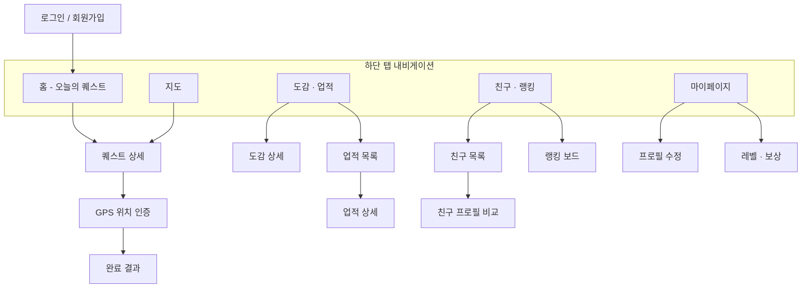

# 02. 화면 명세서

> 관련 문서: `01-project-plan.md` · `04-api-spec.md`
> 라이트 버전 — 화면별 상세 상태 매트릭스 대신 목적·담당·주요 상태·연결 API만 정리한다. 세부 UI 상태는 구현 중 각 담당자가 보완한다.

## 1. 전체 내비게이션 구조

## 2. 화면 목록

### 2-1. 회원·프로필·레벨 (담당: 팀원 1)

| ID | 화면명 | 목적 | 주요 상태 | 연결 API |
|---|---|---|---|---|
| S-01 | 로그인 | 이메일·비밀번호로 로그인 | 입력값 오류, 로그인 실패 | `POST /api/auth/login` |
| S-02 | 회원가입 | 신규 계정 생성 | 중복 이메일·닉네임 오류 | `POST /api/auth/signup` |
| S-03 | 마이페이지 | 내 정보·레벨 요약 확인 | 로딩, 조회 실패 | `GET /api/users/me`, `GET /api/users/me/level` |
| S-04 | 프로필 수정 | 닉네임·프로필 이미지 변경 | 저장 성공·실패 | `PATCH /api/users/me` |
| S-05 | 레벨·보상 화면 | EXP 진행률, 레벨업 보상 이력 | 로딩, 빈 이력 | `GET /api/users/me/level`, `GET /api/users/me/rewards` |
| S-06 | 칭호 선택 | 보유 칭호 중 대표 칭호 설정 | 빈 보유 목록 | `GET /api/users/me/titles`, `PATCH /api/users/me/title` |

### 2-2. 퀘스트·GPS 인증 (담당: 팀원 2)

| ID | 화면명 | 목적 | 주요 상태 | 연결 API |
|---|---|---|---|---|
| S-07 | 메인 홈 | 오늘의 퀘스트 카드 노출 | 로딩, 오늘 배정 없음 | `GET /api/quests/today` |
| S-08 | 퀘스트 목록 | 배정된 퀘스트 전체 목록 | 빈 목록 | `GET /api/quests/today` |
| S-09 | 퀘스트 상세 | 퀘스트 정보·보상·장소 확인 | 로딩, 조회 실패 | `GET /api/quests/{questId}` |
| S-10 | GPS 위치 인증 | 현재 위치·반경 판정, 인증 버튼 | 권한 거부, 반경 밖, 인증 성공 | `POST /api/quests/{questId}/complete` |
| S-11 | 지도 | 주변 퀘스트 위치와 현재 위치 표시 | 위치 조회 실패 | `GET /api/quests/nearby` |
| S-12 | 완료 결과 | EXP·레벨업·신규 도감/업적 결과 표시 | 레벨업 여부에 따른 분기 | `POST /api/quests/{questId}/complete` 응답 |

### 2-3. LifeDex·업적 (담당: 팀원 3)

| ID | 화면명 | 목적 | 주요 상태 | 연결 API |
|---|---|---|---|---|
| S-13 | LifeDex 카테고리 목록 | 카테고리별 수집 진행률 확인 | 로딩 | `GET /api/lifedex/categories`, `GET /api/users/me/lifedex` |
| S-14 | LifeDex 상세 | 카테고리 내 항목별 수집 여부 | 미수집 항목 표시 | `GET /api/lifedex`, `GET /api/users/me/lifedex` |
| S-15 | 업적 목록 | 전체 업적과 달성 현황 | 비밀 업적 마스킹 | `GET /api/achievements`, `GET /api/users/me/achievements` |
| S-16 | 업적 상세 | 단계별 진행도, 달성 조건 | 미달성 상태 | `GET /api/users/me/achievements` |
| S-17 | 비밀 업적 해금 알림 | 조건 달성 시 팝업 노출 | 신규 달성 없음 | 퀘스트 완료 응답의 `collection.newAchievements` |

### 2-4. 친구·랭킹·관리자 (담당: 팀원 4)

| ID | 화면명 | 목적 | 주요 상태 | 연결 API |
|---|---|---|---|---|
| S-18 | 친구 검색 | 닉네임으로 사용자 검색·요청 | 검색 결과 없음 | `GET /api/users/search`, `POST /api/friends/requests` |
| S-19 | 친구 요청 목록 | 받은 요청 수락·거절 | 빈 목록 | `GET /api/friends/requests`, `PATCH /api/friends/requests/{requestId}` |
| S-20 | 친구 목록 | 보유 친구 목록, 삭제 | 빈 목록 | `GET /api/friends`, `DELETE /api/friends/{userId}` |
| S-21 | 친구 프로필 비교 | 친구와 레벨·도감·업적 비교 | 로딩 | `GET /api/friends/{userId}/profile` |
| S-22 | 랭킹 보드 | 전체·친구 랭킹 조회 | 빈 순위(친구 없음) | `GET /api/rankings/global`, `GET /api/rankings/friends` |
| S-23 | 관리자 퀘스트 관리 | 퀘스트 등록·수정·삭제 | 권한 없음, 저장 실패 | `POST /api/admin/quests`, `PATCH /api/admin/quests/{questId}`, `DELETE /api/admin/quests/{questId}` |

## 3. 공통 UI 요소

- 공통 헤더 + 하단 탭 내비게이션(홈 / 지도 / 도감·업적 / 친구·랭킹 / 마이페이지)
- 공통 로딩 인디케이터, 빈 화면(Empty State), 오류 화면(재시도 버튼 포함)
- 공통 알림·모달 컴포넌트(업적 달성 팝업, 친구 요청 알림 등)

## 4. 접근 제어

| 구분 | 대상 화면 |
|---|---|
| 비로그인 접근 가능 | S-01(로그인), S-02(회원가입) |
| 로그인 필요 | 그 외 전체 화면 |
| 관리자 권한 필요 | S-23(관리자 퀘스트 관리) |
