# 03. 데이터베이스 설계

> 관련 문서: `01-project-plan.md` · `04-api-spec.md` · `05-business-rules.md`

## 1. ERD

```mermaid
erDiagram
    USERS ||--o{ USER_TITLES : "보유"
    TITLES ||--o{ USER_TITLES : "부여"
    USERS ||--o{ USER_PROFILE_ITEMS : "보유"
    PROFILE_ITEMS ||--o{ USER_PROFILE_ITEMS : "부여"
    USERS ||--o{ EXP_LOGS : "적립"
    USERS ||--o{ USER_DAILY_QUESTS : "배정받음"
    QUESTS ||--o{ USER_DAILY_QUESTS : "배정됨"
    USER_DAILY_QUESTS ||--o| QUEST_COMPLETIONS : "완료"
    USERS ||--o{ QUEST_COMPLETIONS : "완료기록"
    QUESTS ||--o{ QUEST_COMPLETIONS : "완료대상"
    QUESTS }o--o| LIFEDEX_ITEMS : "연계"
    LIFEDEX_CATEGORIES ||--o{ LIFEDEX_ITEMS : "분류"
    USERS ||--o{ USER_LIFEDEX : "수집"
    LIFEDEX_ITEMS ||--o{ USER_LIFEDEX : "수집됨"
    ACHIEVEMENTS ||--o{ ACHIEVEMENT_STEPS : "단계"
    QUESTS ||--o{ ACHIEVEMENTS : "특정 퀘스트 조건"
    LIFEDEX_CATEGORIES ||--o{ ACHIEVEMENTS : "도감 카테고리 조건"
    USERS ||--o{ USER_ACHIEVEMENTS : "달성기록"
    ACHIEVEMENTS ||--o{ USER_ACHIEVEMENTS : "달성대상"
    USERS ||--o{ FRIEND_REQUESTS : "요청관계"
    USERS ||--o{ FRIENDSHIPS : "친구관계"

    USERS {
        bigint id PK
        varchar email "UNIQUE"
        varchar password
        varchar nickname "UNIQUE"
        varchar role "USER/ADMIN"
        varchar profile_image_url
        int total_exp
        int level
        bigint representative_title_id FK
        datetime created_at
    }
    TITLES {
        bigint id PK
        varchar code "UNIQUE"
        varchar name
        varchar acquire_type "LEVEL/ACHIEVEMENT/EVENT"
    }
    USER_TITLES {
        bigint id PK
        bigint user_id FK
        bigint title_id FK
        varchar source_type "LEVEL/ACHIEVEMENT/EVENT"
        bigint source_id
        datetime acquired_at
    }
    PROFILE_ITEMS {
        bigint id PK
        varchar code "UNIQUE"
        varchar name
        varchar item_type "BACKGROUND/FRAME/BADGE/OUTFIT"
    }
    USER_PROFILE_ITEMS {
        bigint id PK
        bigint user_id FK
        bigint profile_item_id FK
        varchar source_type "LEVEL/ACHIEVEMENT/EVENT"
        bigint source_id
        datetime acquired_at
    }
    LEVEL_REWARDS {
        bigint id PK
        int level
        varchar reward_type "TITLE/PROFILE_ITEM"
        bigint reward_ref_id
    }
    EXP_LOGS {
        bigint id PK
        bigint user_id FK
        varchar source_type "QUEST_COMPLETION/ACHIEVEMENT/EVENT"
        bigint source_id "UNIQUE with user_id/source_type"
        int exp_amount
        datetime created_at
    }
    QUESTS {
        bigint id PK
        varchar title
        varchar grade "NORMAL/RARE/EPIC/LEGENDARY"
        varchar cadence "DAILY/WEEKLY"
        varchar completion_type "LOCATION/SELF_REPORT"
        int exp_reward
        decimal latitude
        decimal longitude
        int radius_m
        bigint lifedex_item_id FK
        varchar created_by "SYSTEM/ADMIN"
        boolean is_active
    }
    USER_DAILY_QUESTS {
        bigint id PK
        bigint user_id FK
        bigint quest_id FK
        date assigned_date
        varchar status "ASSIGNED/COMPLETED/EXPIRED"
        datetime expires_at
    }
    QUEST_COMPLETIONS {
        bigint id PK
        bigint user_daily_quest_id FK "UNIQUE"
        bigint user_id FK
        bigint quest_id FK
        decimal verified_latitude
        decimal verified_longitude
        decimal distance_m
        decimal accuracy_m
        datetime completed_at
    }
    LIFEDEX_CATEGORIES {
        bigint id PK
        varchar name
        varchar icon_key
    }
    LIFEDEX_ITEMS {
        bigint id PK "원본 퀘스트 id와 같다"
        bigint category_id FK
        varchar name
        varchar icon_key
        int display_order
    }
    USER_LIFEDEX {
        bigint id PK
        bigint user_id FK
        bigint lifedex_item_id FK "UNIQUE with user_id"
        datetime acquired_at
    }
    ACHIEVEMENTS {
        bigint id PK
        varchar code "UNIQUE"
        varchar name
        varchar category
        boolean is_secret
        varchar condition_type "CUMULATIVE_COUNT/SPECIFIC_QUEST/LIFEDEX_COUNT"
        bigint target_quest_id FK
        bigint target_lifedex_category_id FK
    }
    ACHIEVEMENT_STEPS {
        bigint id PK
        bigint achievement_id FK
        int step_no
        varchar step_name
        int required_count
        bigint reward_title_id FK
    }
    USER_ACHIEVEMENTS {
        bigint id PK
        bigint user_id FK
        bigint achievement_id FK "UNIQUE with user_id"
        int current_step
        boolean is_completed
        datetime achieved_at
    }
    FRIEND_REQUESTS {
        bigint id PK
        bigint sender_id FK
        bigint receiver_id FK
        varchar status "PENDING/ACCEPTED/REJECTED"
        datetime created_at
        datetime responded_at
    }
    FRIENDSHIPS {
        bigint id PK
        bigint user_id FK
        bigint friend_id FK "UNIQUE with user_id"
        datetime created_at
    }
```

**참고**: `LEVEL_REWARDS`는 레벨별 보상 참조 테이블로, 한 레벨에 여러 보상을 둘 수 있다. `reward_ref_id`는 `reward_type`에 따라 `TITLES.id` 또는 `PROFILE_ITEMS.id`를 가리키는 다형(polymorphic) 참조라 다이어그램에 관계선을 그리지 않았다. `FRIEND_REQUESTS`(sender/receiver)·`FRIENDSHIPS`(user/friend)는 모두 `USERS.id`를 두 번 참조하며, 다이어그램에는 대표 관계선만 표시했다.

## 2. 테이블 정의

### 2-1. 회원·프로필·레벨 (담당: 팀원 1)

**USERS**

| 컬럼 | 타입 | 제약 | 설명 |
|---|---|---|---|
| id | BIGINT | PK, AUTO_INCREMENT | 사용자 ID |
| email | VARCHAR(255) | UNIQUE, NOT NULL | 로그인 이메일 |
| password | VARCHAR(255) | NOT NULL | 암호화된 비밀번호 |
| nickname | VARCHAR(50) | UNIQUE, NOT NULL | 닉네임 |
| role | ENUM | NOT NULL, DEFAULT USER | USER / ADMIN |
| profile_image_url | VARCHAR(500) | NULL | 프로필 이미지 URL |
| total_exp | INT | NOT NULL, DEFAULT 0 | 누적 경험치 |
| level | INT | NOT NULL, DEFAULT 1 | 현재 레벨 |
| selected_character_id | BIGINT | NULL, FK → AVATAR_CHARACTERS.id | 선택한 게임 캐릭터 |
| representative_title_id | BIGINT | NULL, FK → TITLES.id | 대표 칭호 |
| representative_badge_id | BIGINT | NULL, FK → PROFILE_ITEMS.id | 대표 배지 |
| created_at | DATETIME | NOT NULL | 가입 일시 |
| updated_at | DATETIME | NOT NULL | 정보 수정 일시 |

**AVATAR_CHARACTERS**

| 컬럼 | 타입 | 제약 | 설명 |
|---|---|---|---|
| id | BIGINT | PK | 캐릭터 ID |
| code | VARCHAR(50) | UNIQUE, NOT NULL | 앱 에셋과 연결하는 코드 |
| name | VARCHAR(50) | NOT NULL | 표시 이름 |
| asset_key | VARCHAR(100) | NOT NULL | Flutter 번들 이미지 키 |
| is_active | BOOLEAN | NOT NULL | 선택 가능 여부 |

**TITLES**

| 컬럼 | 타입 | 제약 | 설명 |
|---|---|---|---|
| id | BIGINT | PK | 칭호 ID |
| code | VARCHAR(50) | UNIQUE, NOT NULL | 칭호 코드 |
| name | VARCHAR(50) | NOT NULL | 칭호명(예: "초보 탐험가") |
| description | VARCHAR(255) | NULL | 설명 |
| acquire_type | ENUM | NOT NULL | LEVEL / ACHIEVEMENT / EVENT |

**USER_TITLES**

| 컬럼 | 타입 | 제약 | 설명 |
|---|---|---|---|
| id | BIGINT | PK | ID |
| user_id | BIGINT | FK → USERS.id | 사용자 |
| title_id | BIGINT | FK → TITLES.id | 칭호 |
| source_type | ENUM | NOT NULL | LEVEL / ACHIEVEMENT / EVENT |
| source_id | BIGINT | NOT NULL | 획득 근거 ID(레벨 또는 업적 단계 ID 등) |
| acquired_at | DATETIME | NOT NULL | 획득 일시 |
| | | UNIQUE(user_id, title_id) | 중복 획득 방지 |

**PROFILE_ITEMS**

| 컬럼 | 타입 | 제약 | 설명 |
|---|---|---|---|
| id | BIGINT | PK | 프로필 아이템 ID |
| code | VARCHAR(50) | UNIQUE, NOT NULL | 아이템 코드 |
| name | VARCHAR(100) | NOT NULL | 아이템명 |
| item_type | ENUM | NOT NULL | BACKGROUND / FRAME / BADGE / OUTFIT |

**USER_PROFILE_ITEMS**

| 컬럼 | 타입 | 제약 | 설명 |
|---|---|---|---|
| id | BIGINT | PK | ID |
| user_id | BIGINT | FK → USERS.id | 사용자 |
| profile_item_id | BIGINT | FK → PROFILE_ITEMS.id | 획득 아이템 |
| source_type | ENUM | NOT NULL | LEVEL / ACHIEVEMENT / EVENT |
| source_id | BIGINT | NOT NULL | 획득 근거 ID |
| acquired_at | DATETIME | NOT NULL | 획득 일시 |
| | | UNIQUE(user_id, profile_item_id) | 중복 획득 방지 |

**LEVEL_REWARDS** (참조 테이블)

| 컬럼 | 타입 | 제약 | 설명 |
|---|---|---|---|
| id | BIGINT | PK | ID |
| level | INT | NOT NULL | 대상 레벨 |
| reward_type | ENUM | NOT NULL | TITLE / PROFILE_ITEM |
| reward_ref_id | BIGINT | NOT NULL | 보상 유형별 참조 ID |
| description | VARCHAR(255) | NULL | 보상 설명 |
| | | UNIQUE(level, reward_type, reward_ref_id) | 한 레벨의 동일 보상 중복 방지 |

**EXP_LOGS** — EXP 지급 이력(팀원 1이 실제로 적립을 확정하는 지점)

| 컬럼 | 타입 | 제약 | 설명 |
|---|---|---|---|
| id | BIGINT | PK | ID |
| user_id | BIGINT | FK → USERS.id | 사용자 |
| source_type | ENUM | NOT NULL | QUEST_COMPLETION / ACHIEVEMENT / EVENT |
| source_id | BIGINT | NOT NULL | 발생 근거 ID(예: quest_completions.id) |
| exp_amount | INT | NOT NULL | 지급된 EXP(지급 시점 값 스냅샷) |
| created_at | DATETIME | NOT NULL | 지급 일시 |
| | | UNIQUE(user_id, source_type, source_id) | 동일 완료 건 EXP 재지급 방지 |

> `exp_amount`는 지급 시점의 값을 그대로 저장한다(스냅샷). 이후 `QUESTS.exp_reward`가 조정되어도 과거 지급 이력은 변하지 않는다.

### 2-2. 퀘스트·GPS 인증 (담당: 팀원 2)

**QUESTS**

| 컬럼 | 타입 | 제약 | 설명 |
|---|---|---|---|
| id | BIGINT | PK | 퀘스트 ID |
| title | VARCHAR(100) | NOT NULL | 퀘스트명 |
| description | VARCHAR(500) | NULL | 설명 |
| category | VARCHAR(30) | NOT NULL, DEFAULT ETC | HEALTH_FITNESS / DAILY_HABIT / LEARNING_GROWTH / RELATIONSHIP_COMMUNITY / FOOD_CAFE / NATURE_OUTDOOR / CULTURE_TRAVEL / ETC |
| grade | ENUM | NOT NULL | NORMAL / RARE / EPIC / LEGENDARY |
| cadence | ENUM | NOT NULL, DEFAULT DAILY | DAILY / WEEKLY — 배정 트랙을 가르는 기준(`05-business-rules.md` §1). 협동은 참여 형태이므로 이 축에 두지 않는다 |
| completion_type | ENUM | NOT NULL | LOCATION(위치 인증) / SELF_REPORT(직접 완료) |
| exp_reward | INT | NOT NULL | 완료 시 지급 EXP(등급별 기준값) |
| place_name | VARCHAR(100) | NULL | 장소명(LOCATION 타입에만 사용) |
| latitude | DECIMAL(10,7) | NULL | 장소 위도 |
| longitude | DECIMAL(10,7) | NULL | 장소 경도 |
| radius_m | INT | NULL | 인증 반경(m) |
| lifedex_item_id | BIGINT | NULL, FK → LIFEDEX_ITEMS.id | 완료 시 자동 등록될 도감 항목 |
| created_by | ENUM | NOT NULL | SYSTEM / ADMIN |
| is_active | BOOLEAN | NOT NULL, DEFAULT TRUE | 배정 풀 노출 여부 |
| created_at | DATETIME | NOT NULL | 등록 일시 |

**USER_DAILY_QUESTS** — "오늘의 퀘스트" 배정 기록

| 컬럼 | 타입 | 제약 | 설명 |
|---|---|---|---|
| id | BIGINT | PK | ID |
| user_id | BIGINT | FK → USERS.id | 사용자 |
| quest_id | BIGINT | FK → QUESTS.id | 배정된 퀘스트 |
| assigned_date | DATE | NOT NULL | **주기 시작일** — 일간은 논리적 일자 당일, 주간은 그 주 월요일 (`05-business-rules.md` §1-2) |
| status | ENUM | NOT NULL | ASSIGNED / COMPLETED / EXPIRED |
| expires_at | DATETIME | NOT NULL | 만료 일시 — 다음 주기 시작 04:00 |
| | | UNIQUE(user_id, quest_id, assigned_date) | 주기 단위 중복 배정 방지 |

**QUEST_ASSIGNMENT_MARKERS** — 배정 생성 마커(트랙·주기당 1행)

| 컬럼 | 타입 | 제약 | 설명 |
|---|---|---|---|
| id | BIGINT | PK | ID |
| user_id | BIGINT | NOT NULL | 사용자(크로스도메인 FK 보류) |
| cadence | ENUM | NOT NULL | DAILY / WEEKLY — 트랙마다 갱신 주기가 달라 키에 포함한다 |
| period_start | DATE | NOT NULL | 주기 시작일 — `USER_DAILY_QUESTS.assigned_date`와 같은 값 |
| created_at | DATETIME | NOT NULL | 생성 일시 |
| | | UNIQUE(user_id, cadence, period_start) | 동시 요청의 중복 생성 차단 |

> 배정은 지연 생성이라 같은 사용자의 동시 요청이 모두 "배정 없음"을 보고 각각 생성을 시도할 수 있다. `UNIQUE(user_id, quest_id, assigned_date)`는 이를 막지 못한다 — 두 요청이 서로 다른 퀘스트를 뽑으면 겹치는 행이 없어 제약에 걸리지 않고, 한 트랙에 6개가 배정되어 슬롯 계약이 깨진다. 생성 트랜잭션이 이 테이블에 행을 **먼저** 넣고 유니크 위반이면 생성을 포기해, 판정이 애플리케이션 조회가 아니라 DB 제약에서 이루어지게 한다.

**QUEST_COMPLETIONS** — 완료·위치 인증 기록

| 컬럼 | 타입 | 제약 | 설명 |
|---|---|---|---|
| id | BIGINT | PK | ID |
| user_daily_quest_id | BIGINT | FK → USER_DAILY_QUESTS.id, **UNIQUE** | 완료 대상 배정 |
| user_id | BIGINT | FK → USERS.id | 사용자(조회 편의를 위한 비정규화) |
| quest_id | BIGINT | FK → QUESTS.id | 퀘스트(조회 편의를 위한 비정규화) |
| verified_latitude | DECIMAL(10,7) | NULL | 인증 시점 위도(LOCATION 타입) |
| verified_longitude | DECIMAL(10,7) | NULL | 인증 시점 경도(LOCATION 타입) |
| distance_m | DECIMAL(8,2) | NULL | 장소와의 거리(m) |
| accuracy_m | DECIMAL(8,2) | NULL | 클라이언트가 보고한 위치 정확도(m) |
| completed_at | DATETIME | NOT NULL | 완료 일시 |

> `user_daily_quest_id`의 UNIQUE 제약이 **완료 멱등성의 근거**다 — 하나의 배정 건은 완료 기록을 하나만 가질 수 있으므로, 동일 요청이 반복돼도 DB 레벨에서 중복 생성이 차단된다.

### 2-3. LifeDex·업적 (담당: 팀원 3)

**LIFEDEX_CATEGORIES**

| 컬럼 | 타입 | 제약 | 설명 |
|---|---|---|---|
| id | BIGINT | PK | ID |
| name | VARCHAR(50) | NOT NULL | 카테고리명(여행, 음식, 카페 등) |
| icon_key | VARCHAR(40) | NULL | 카테고리 대표 장소 모티프 키. 규칙은 09-design-system §2 |

**LIFEDEX_ITEMS**

| 컬럼 | 타입 | 제약 | 설명 |
|---|---|---|---|
| id | BIGINT | PK | ID. 항목을 만들어 낸 퀘스트의 id와 같게 둔다(비즈니스 규칙 §6-1) |
| category_id | BIGINT | NOT NULL, FK → LIFEDEX_CATEGORIES.id | 소속 카테고리 |
| name | VARCHAR(100) | NOT NULL, UNIQUE | 항목명(= 퀘스트의 `place_name`) |
| description | VARCHAR(500) | NULL | 설명 |
| icon_key | VARCHAR(40) | NULL | 장소 모티프 키. 비면 카테고리 키로 물러난다. 규칙은 09-design-system §2 |
| display_order | INT | NOT NULL | 카테고리 안 정렬 순서 |

**USER_LIFEDEX**

| 컬럼 | 타입 | 제약 | 설명 |
|---|---|---|---|
| id | BIGINT | PK | ID |
| user_id | BIGINT | FK → USERS.id | 사용자 |
| lifedex_item_id | BIGINT | FK → LIFEDEX_ITEMS.id | 수집 항목 |
| acquired_at | DATETIME | NOT NULL | 획득 일시 |
| | | UNIQUE(user_id, lifedex_item_id) | 중복 등록 방지 |

**ACHIEVEMENTS**

| 컬럼 | 타입 | 제약 | 설명 |
|---|---|---|---|
| id | BIGINT | PK | ID |
| code | VARCHAR(50) | UNIQUE, NOT NULL | 업적 코드 |
| name | VARCHAR(100) | NOT NULL | 업적명 |
| description | VARCHAR(255) | NULL | 설명(비밀 업적은 미달성 시 비공개) |
| category | VARCHAR(50) | NULL | 분류 |
| is_secret | BOOLEAN | NOT NULL, DEFAULT FALSE | 비밀 업적 여부 |
| condition_type | ENUM | NOT NULL | CUMULATIVE_COUNT / SPECIFIC_QUEST / LIFEDEX_COUNT |
| target_quest_id | BIGINT | NULL, FK → QUESTS.id | SPECIFIC_QUEST의 대상 퀘스트 |
| target_lifedex_category_id | BIGINT | NULL, FK → LIFEDEX_CATEGORIES.id | LIFEDEX_COUNT의 대상 카테고리(NULL이면 전체) |

> `SPECIFIC_QUEST`는 `target_quest_id`가 필수이고, `LIFEDEX_COUNT`는 `target_lifedex_category_id`로 집계 범위를 정한다. `CUMULATIVE_COUNT`는 전체 퀘스트 완료 횟수를 기준으로 한다. 달성 기준값은 단계별 `ACHIEVEMENT_STEPS.required_count`에 저장한다.

**ACHIEVEMENT_STEPS** — 단계별 업적(예: 카페 탐험가 I~V)

| 컬럼 | 타입 | 제약 | 설명 |
|---|---|---|---|
| id | BIGINT | PK | ID |
| achievement_id | BIGINT | FK → ACHIEVEMENTS.id | 소속 업적 |
| step_no | INT | NOT NULL | 단계 번호 |
| step_name | VARCHAR(100) | NOT NULL | 단계명 |
| required_count | INT | NOT NULL | 단계 달성 기준 횟수 |
| reward_title_id | BIGINT | NULL, FK → TITLES.id | 단계 달성 보상 칭호 |
| | | UNIQUE(achievement_id, step_no) | |

**USER_ACHIEVEMENTS**

| 컬럼 | 타입 | 제약 | 설명 |
|---|---|---|---|
| id | BIGINT | PK | ID |
| user_id | BIGINT | FK → USERS.id | 사용자 |
| achievement_id | BIGINT | FK → ACHIEVEMENTS.id | 업적 |
| current_step | INT | NOT NULL, DEFAULT 0 | 현재 달성 단계 |
| is_completed | BOOLEAN | NOT NULL, DEFAULT FALSE | 최종 단계 달성 여부 |
| achieved_at | DATETIME | NULL | 최초 달성 일시 |
| | | UNIQUE(user_id, achievement_id) | |

### 2-4. 친구·랭킹·관리 (담당: 팀원 4)

**FRIEND_REQUESTS**

| 컬럼 | 타입 | 제약 | 설명 |
|---|---|---|---|
| id | BIGINT | PK | ID |
| sender_id | BIGINT | FK → USERS.id | 요청자 |
| receiver_id | BIGINT | FK → USERS.id | 수신자 |
| status | ENUM | NOT NULL | PENDING / ACCEPTED / REJECTED |
| created_at | DATETIME | NOT NULL | 요청 일시 |
| responded_at | DATETIME | NULL | 응답 일시 |

**FRIENDSHIPS** — 수락된 친구 관계(양방향 각 1행)

| 컬럼 | 타입 | 제약 | 설명 |
|---|---|---|---|
| id | BIGINT | PK | ID |
| user_id | BIGINT | FK → USERS.id | 사용자 |
| friend_id | BIGINT | FK → USERS.id | 친구 |
| created_at | DATETIME | NOT NULL | 친구 성립 일시 |
| | | UNIQUE(user_id, friend_id) | |

> 랭킹은 MVP에서 별도 테이블 없이 `USERS.total_exp` / `level`을 직접 조회한다. 구현 방식 논의는 `05-business-rules.md` §10 참조.

> 관리자 등록 퀘스트는 별도 테이블 없이 `QUESTS.created_by = ADMIN`으로 표현하며, 배정 풀에 일반 퀘스트와 동일하게 포함된다.

## 3. 인덱스 설계 노트

| 대상 | 인덱스 | 목적 |
|---|---|---|
| USER_DAILY_QUESTS | UNIQUE(user_id, quest_id, assigned_date) | 주기 단위 중복 배정 방지 — `assigned_date`에 주기 시작일이 들어가므로 주간도 이 제약 하나로 막힌다 |
| USER_DAILY_QUESTS | INDEX(user_id, expires_at) | 배정 목록 조회 기준이 `assigned_date = 오늘`이 아니라 만료 전 배정 건이다(`05-business-rules.md` §1-2). 트랙마다 `assigned_date`가 달라 기존 `(user_id, assigned_date)` 인덱스로는 한 번에 못 읽는다 |
| QUEST_ASSIGNMENT_MARKERS | UNIQUE(user_id, cadence, period_start) | 지연 생성의 동시 요청 경합 차단 — 생성 트랜잭션이 이 행을 먼저 넣고, 유니크 위반이면 다른 요청이 이미 만든 것으로 보고 재조회한다 |
| QUEST_COMPLETIONS | UNIQUE(user_daily_quest_id) | 완료 멱등성 보장(핵심) |
| EXP_LOGS | UNIQUE(user_id, source_type, source_id) | 동일 근거의 EXP 재지급 방지 |
| USER_LIFEDEX | UNIQUE(user_id, lifedex_item_id) | 도감 중복 등록 방지 |
| USER_ACHIEVEMENTS | UNIQUE(user_id, achievement_id) | 업적 중복 진행 레코드 방지 |
| USERS | INDEX(total_exp DESC) | 랭킹 정렬 조회 최적화 |
| QUESTS | INDEX(latitude, longitude) 또는 공간 인덱스 | 주변 퀘스트 조회(§4 참조) |
| FRIEND_REQUESTS | INDEX(receiver_id, status) | 받은 요청 목록 조회 |
| GROUP_QUEST_PARTICIPANTS | UNIQUE(group_quest_id, user_id) | 한 사용자의 참여 신청 행을 하나로 유지하고 재신청 시 상태만 전환 |
| GROUP_QUEST_PARTICIPANTS | INDEX(group_quest_id, status, id) | 공동 완료 시 보상 대상 신청자 조회 |

## 4. 위치 데이터 처리 방식(참고)

퀘스트 수가 적은 MVP 단계에서는 `latitude`/`longitude`를 `DECIMAL` 컬럼으로 저장하고, 거리 계산은 애플리케이션 레이어에서 Haversine 공식으로 처리해도 충분하다. 퀘스트 수가 늘어나 "내 주변 N km" 조회 성능이 문제가 되면 MySQL `POINT` 타입 + `SPATIAL INDEX`(`ST_Distance_Sphere` 활용) 또는 위경도 범위 기반 1차 필터링(바운딩 박스) 후 정밀 계산하는 방식으로 전환한다. MVP에서는 전자(단순 컬럼) 방식을 기본으로 한다.

## 5. 명명 규칙

- DB 컬럼: `snake_case`
- API 필드(JSON): `camelCase`
- ENUM 값: `UPPER_SNAKE_CASE`
- 매핑은 JPA 엔티티의 `@JsonProperty` 또는 DTO 변환 계층에서 처리한다.
