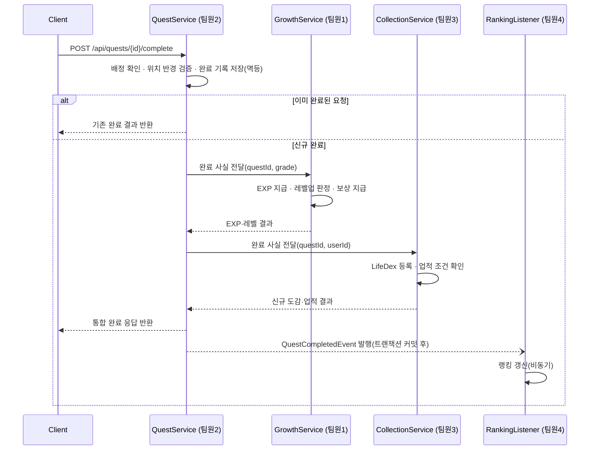

# 04. API 명세서

> 관련 문서: `03-database-design.md` · `05-business-rules.md` · `06-team-roles.md`

## 1. 공통 규칙

- Base URL: `/api`
- 인증: `Authorization: Bearer {accessToken}` (JWT). 로그인·회원가입·리프레시를 제외한 전 API는 인증 필요.
- 요청·응답 형식: JSON, UTF-8
- 날짜·시간: ISO 8601 (`yyyy-MM-dd'T'HH:mm:ss`)
- 페이지네이션: 요청 `?page=0&size=20`, 응답 `{ content, page, size, totalElements, totalPages }`

### 공통 응답 포맷

성공:

```json
{
  "success": true,
  "data": { },
  "error": null
}
```

실패:

```json
{
  "success": false,
  "data": null,
  "error": { "code": "QUEST_ALREADY_COMPLETED", "message": "이미 완료한 퀘스트입니다." }
}
```

## 2. 공통 에러 코드

| HTTP Status | code | 설명 |
|---|---|---|
| 400 | INVALID_REQUEST | 요청 형식 오류 |
| 401 | UNAUTHORIZED | 인증 필요 |
| 401 | TOKEN_EXPIRED | 액세스 토큰 만료 |
| 403 | FORBIDDEN | 권한 없음(예: 관리자 API에 일반 사용자 접근) |
| 404 | RESOURCE_NOT_FOUND | 대상 리소스 없음 |
| 409 | CONFLICT | 상태 충돌(중복 등) |
| 422 | VALIDATION_FAILED | 입력값 검증 실패 |
| 500 | INTERNAL_SERVER_ERROR | 서버 오류 |

### 도메인별 에러 코드

| code | HTTP Status | 설명 |
|---|---|---|
| DUPLICATE_EMAIL | 409 | 이미 가입된 이메일 |
| DUPLICATE_NICKNAME | 409 | 이미 사용 중인 닉네임 |
| QUEST_ALREADY_COMPLETED | 409 | 이미 완료 처리된 배정 건 |
| QUEST_EXPIRED | 409 | 만료된 퀘스트 완료 시도 |
| OUT_OF_RADIUS | 422 | 인증 반경 밖(응답에 현재 거리 포함) |
| LOCATION_PERMISSION_REQUIRED | 400 | 위치 권한 미허용 |
| DUPLICATE_FRIEND_REQUEST | 409 | 이미 대기 중인 친구 요청 존재 |
| SELF_FRIEND_REQUEST_NOT_ALLOWED | 400 | 자기 자신에게 친구 요청 |
| FRIENDSHIP_NOT_FOUND | 404 | 존재하지 않는 친구 관계 |

## 3. 도메인별 엔드포인트

### 3-1. 인증·회원·레벨 (담당: 팀원 1)

| Method | Path | 설명 | 인증 |
|---|---|---|---|
| POST | /api/auth/signup | 회원가입 | 불필요 |
| POST | /api/auth/login | 로그인, 토큰 발급 | 불필요 |
| POST | /api/auth/reissue | 액세스 토큰 재발급 | 리프레시 토큰 |
| GET | /api/users/me | 내 정보 조회 | 필요 |
| PATCH | /api/users/me | 내 정보 수정 | 필요 |
| GET | /api/users/me/level | 레벨·EXP 진행 상태 조회 | 필요 |
| GET | /api/users/me/titles | 보유 칭호 목록 | 필요 |
| PATCH | /api/users/me/title | 대표 칭호 설정(해제 시 null 전송) | 필요 |
| GET | /api/users/me/rewards | 레벨업 보상 이력 조회 | 필요 |

### 3-2. 퀘스트·GPS 인증 (담당: 팀원 2)

| Method | Path | 설명 | 인증 |
|---|---|---|---|
| GET | /api/quests/today | 오늘의 퀘스트 목록 조회 | 필요 |
| GET | /api/quests/{questId} | 퀘스트 상세 조회 | 필요 |
| GET | /api/quests/nearby | 주변 퀘스트 조회(`lat`,`lng`,`radiusKm`) | 필요 |
| POST | /api/quests/{questId}/complete | 퀘스트 완료 처리(핵심 API, §4 참조) | 필요 |
| GET | /api/users/me/quests/history | 완료·인증 기록 조회 | 필요 |

### 3-3. LifeDex·업적 (담당: 팀원 3)

| Method | Path | 설명 | 인증 |
|---|---|---|---|
| GET | /api/lifedex/categories | 도감 카테고리 목록 | 필요 |
| GET | /api/lifedex | 전체 도감 항목 목록(카테고리별) | 필요 |
| GET | /api/users/me/lifedex | 내 도감 진행 현황(수집 여부·진행률) | 필요 |
| GET | /api/achievements | 업적 목록(비밀 업적은 미달성 시 마스킹) | 필요 |
| GET | /api/users/me/achievements | 내 업적 달성 현황 | 필요 |

### 3-4. 친구·랭킹·관리자 (담당: 팀원 4)

| Method | Path | 설명 | 인증 |
|---|---|---|---|
| GET | /api/users/search | 닉네임으로 사용자 검색 | 필요 |
| POST | /api/friends/requests | 친구 요청 보내기 | 필요 |
| GET | /api/friends/requests | 받은 친구 요청 목록 | 필요 |
| PATCH | /api/friends/requests/{requestId} | 요청 수락·거절 | 필요 |
| GET | /api/friends | 친구 목록 | 필요 |
| DELETE | /api/friends/{userId} | 친구 삭제 | 필요 |
| GET | /api/friends/{userId}/profile | 친구 프로필·기록 비교 | 필요 |
| GET | /api/rankings/global | 전체 랭킹 조회 | 필요 |
| GET | /api/rankings/friends | 친구 랭킹 조회 | 필요 |
| POST | /api/admin/quests | 퀘스트 등록(관리자) | 필요(관리자) |
| PATCH | /api/admin/quests/{questId} | 퀘스트 수정(관리자) | 필요(관리자) |
| DELETE | /api/admin/quests/{questId} | 퀘스트 삭제(관리자) | 필요(관리자) |

## 4. 핵심 API 상세 — 퀘스트 완료

4개 담당 영역이 모두 얽히는 API이므로 별도로 상세히 정의한다.

### 요청

```
POST /api/quests/{questId}/complete
```

```json
{
  "latitude": 37.5665,
  "longitude": 126.9780,
  "accuracy": 12.5
}
```

`latitude`/`longitude`/`accuracy`는 `completion_type = LOCATION`인 퀘스트에만 필요하다. `SELF_REPORT` 퀘스트는 본문 없이 호출한다.

### 처리 흐름



퀘스트 완료는 단일 요청으로 여러 도메인 상태를 갱신하므로, 완료 기록 저장까지는 하나의 트랜잭션으로 묶고 랭킹 갱신은 커밋 이후 이벤트로 분리해 처리한다.

### 응답

```json
{
  "completionId": 4821,
  "questId": 12,
  "grade": "RARE",
  "completedAt": "2026-08-03T14:20:00",
  "duplicated": false,
  "location": {
    "distanceM": 23.4
  },
  "growth": {
    "expGained": 30,
    "totalExp": 350,
    "previousLevel": 4,
    "currentLevel": 5,
    "levelUp": true,
    "rewards": [
      { "type": "TITLE", "code": "novice_explorer", "name": "초보 탐험가" }
    ]
  },
  "collection": {
    "newLifedexItems": [
      { "id": 12, "name": "첫 카페 탐험" }
    ],
    "newAchievements": [
      { "id": 3, "name": "카페 탐험가 I" }
    ]
  }
}
```

- `location`은 `completion_type = LOCATION`인 경우에만 포함된다.
- `duplicated: true`인 경우 `growth.expGained`는 0이며 재지급되지 않는다. 응답 본문은 최초 완료 시의 결과를 그대로 반환한다.
- 랭킹 갱신은 비동기 처리되어 이 응답에 포함되지 않는다. 최신 순위는 `GET /api/rankings/*`로 조회한다.

### 오류 케이스

| 상황 | code | HTTP Status |
|---|---|---|
| 반경 밖에서 인증 시도 | OUT_OF_RADIUS | 422 |
| 배정되지 않은 퀘스트 완료 시도 | RESOURCE_NOT_FOUND | 404 |
| 만료된 배정 건 완료 시도 | QUEST_EXPIRED | 409 |
| 위치 권한 없이 LOCATION 퀘스트 요청 | LOCATION_PERMISSION_REQUIRED | 400 |

## 5. 인증 필요 여부 요약

| 구분 | 대상 |
|---|---|
| 인증 불필요 | 회원가입, 로그인, 토큰 재발급 |
| 일반 인증 필요 | 위 목록을 제외한 전체 API |
| 관리자 권한 필요 | `/api/admin/**` |
