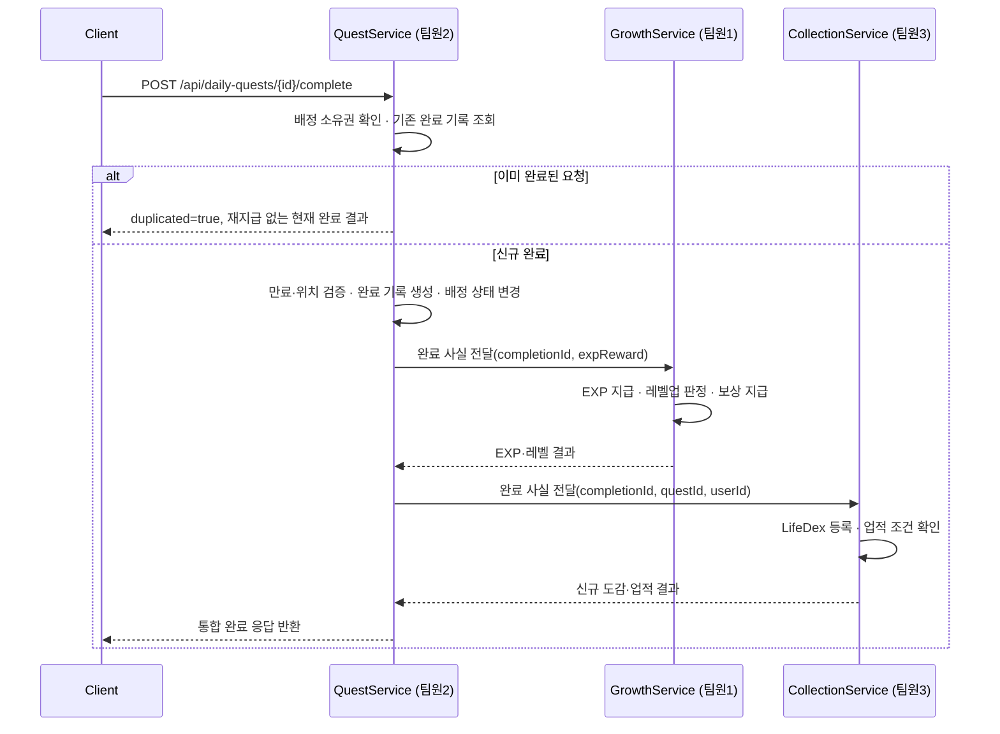

# 04. API 명세서

> 관련 문서: `03-database-design.md` · `05-business-rules.md` · `06-team-roles.md`

## 1. 공통 규칙

- Base URL: `/api`
- 인증: `Authorization: Bearer {accessToken}` (JWT). 로그인·회원가입·리프레시를 제외한 전 API는 인증 필요.
- 요청·응답 형식: JSON, UTF-8
- 날짜·시간: ISO 8601 (`yyyy-MM-dd'T'HH:mm:ss`)
- 페이지네이션: 요청 `?page=0&size=20`, 응답 `{ content, page, size, totalElements, totalPages }`

### 공통 응답 포맷

성공:

```json
{
  "success": true,
  "data": { },
  "error": null
}
```

실패:

```json
{
  "success": false,
  "data": null,
  "error": { "code": "OUT_OF_RADIUS", "message": "퀘스트 인증 반경 밖입니다." }
}
```

## 2. 공통 에러 코드

| HTTP Status | code | 설명 |
|---|---|---|
| 400 | INVALID_REQUEST | 요청 형식 오류 |
| 401 | UNAUTHORIZED | 인증 필요 |
| 401 | TOKEN_EXPIRED | 액세스 토큰 만료 |
| 403 | FORBIDDEN | 권한 없음(예: 관리자 API에 일반 사용자 접근) |
| 404 | RESOURCE_NOT_FOUND | 대상 리소스 없음 |
| 409 | CONFLICT | 상태 충돌(중복 등) |
| 422 | VALIDATION_FAILED | 입력값 검증 실패 |
| 500 | INTERNAL_SERVER_ERROR | 서버 오류 |

### 도메인별 에러 코드

| code | HTTP Status | 설명 |
|---|---|---|
| DUPLICATE_EMAIL | 409 | 이미 가입된 이메일 |
| DUPLICATE_NICKNAME | 409 | 이미 사용 중인 닉네임 |
| QUEST_EXPIRED | 409 | 만료된 퀘스트 완료 시도 |
| OUT_OF_RADIUS | 422 | 인증 반경 밖(응답에 현재 거리 포함) |
| LOCATION_REQUIRED | 400 | LOCATION 퀘스트에 위치 좌표 또는 정확도 누락 |
| LOCATION_ACCURACY_TOO_LOW | 422 | 위치 정확도가 허용 기준보다 낮음 |
| DUPLICATE_FRIEND_REQUEST | 409 | 이미 대기 중인 친구 요청 존재 |
| SELF_FRIEND_REQUEST_NOT_ALLOWED | 400 | 자기 자신에게 친구 요청 |
| FRIENDSHIP_NOT_FOUND | 404 | 존재하지 않는 친구 관계 |

## 3. 도메인별 엔드포인트

### 3-1. 인증·회원·레벨 (담당: 팀원 1)

| Method | Path | 설명 | 인증 |
|---|---|---|---|
| POST | /api/auth/signup | 회원가입 | 불필요 |
| POST | /api/auth/login | 로그인, 토큰 발급 | 불필요 |
| POST | /api/auth/reissue | 액세스 토큰 재발급 | 리프레시 토큰 |
| GET | /api/users/me | 내 정보 조회 | 필요 |
| PATCH | /api/users/me | 내 정보 수정 | 필요 |
| GET | /api/users/me/level | 레벨·EXP 진행 상태 조회 | 필요 |
| GET | /api/users/me/titles | 보유 칭호 목록 | 필요 |
| PATCH | /api/users/me/title | 대표 칭호 설정(해제 시 null 전송) | 필요 |
| GET | /api/users/me/rewards | 레벨업 보상 이력 조회 | 필요 |

### 3-2. 퀘스트·GPS 인증 (담당: 팀원 2)

| Method | Path | 설명 | 인증 |
|---|---|---|---|
| GET | /api/quests/today | 오늘의 퀘스트 목록 조회 | 필요 |
| GET | /api/quests/{questId} | 퀘스트 상세 조회 | 필요 |
| GET | /api/quests/nearby | 오늘 배정된 위치 퀘스트 중 주변 항목 조회(`lat`,`lng`,`radiusKm`) | 필요 |
| POST | /api/daily-quests/{dailyQuestId}/complete | 배정 건 완료 처리(핵심 API, §4 참조) | 필요 |
| GET | /api/users/me/quests/history | 완료·인증 기록 조회 | 필요 |

### 3-3. LifeDex·업적 (담당: 팀원 3)

| Method | Path | 설명 | 인증 |
|---|---|---|---|
| GET | /api/lifedex/categories | 도감 카테고리 목록 | 필요 |
| GET | /api/lifedex | 전체 도감 항목 목록(카테고리별) | 필요 |
| GET | /api/users/me/lifedex | 내 도감 진행 현황(수집 여부·진행률) | 필요 |
| GET | /api/achievements | 업적 목록(비밀 업적은 미달성 시 마스킹) | 필요 |
| GET | /api/users/me/achievements | 내 업적 달성 현황 | 필요 |

### 3-4. 친구·랭킹·관리자 (담당: 팀원 4)

| Method | Path | 설명 | 인증 |
|---|---|---|---|
| GET | /api/users/search | 닉네임으로 사용자 검색 | 필요 |
| POST | /api/friends/requests | 친구 요청 보내기 | 필요 |
| GET | /api/friends/requests | 받은 친구 요청 목록 | 필요 |
| PATCH | /api/friends/requests/{requestId} | 요청 수락·거절 | 필요 |
| GET | /api/friends | 친구 목록 | 필요 |
| DELETE | /api/friends/{userId} | 친구 삭제 | 필요 |
| GET | /api/friends/{userId}/profile | 친구 프로필·기록 비교 | 필요 |
| GET | /api/rankings/global | 전체 랭킹 조회 | 필요 |
| GET | /api/rankings/friends | 친구 랭킹 조회 | 필요 |
| POST | /api/admin/quests | 퀘스트 등록(관리자) | 필요(관리자) |
| PATCH | /api/admin/quests/{questId} | 퀘스트 수정(관리자) | 필요(관리자) |
| DELETE | /api/admin/quests/{questId} | 퀘스트 소프트 삭제(`is_active=false`, 관리자) | 필요(관리자) |

### 3-5. 엔드포인트별 요청·응답·오류 요약

모든 성공 응답은 §1의 `data` 안에 아래 응답 필드를 담는다. `path`, `query` 외 입력은 JSON 요청 본문이다.

**인증·회원·레벨**

| API | 요청 | 성공 응답 `data` | 주요 오류 |
|---|---|---|---|
| `POST /auth/signup` | `email`, `password`, `nickname` | `userId`, `email`, `nickname`, `createdAt` | `DUPLICATE_EMAIL`, `DUPLICATE_NICKNAME`, `VALIDATION_FAILED` |
| `POST /auth/login` | `email`, `password` | `accessToken`, `refreshToken`, `expiresIn`, `user` | `UNAUTHORIZED` |
| `POST /auth/reissue` | `refreshToken` | `accessToken`, `expiresIn` | `UNAUTHORIZED`, `TOKEN_EXPIRED` |
| `GET /users/me` | 없음 | `id`, `email`, `nickname`, `profileImageUrl`, `role`, `representativeTitle` | `UNAUTHORIZED` |
| `PATCH /users/me` | 변경할 `nickname`, `profileImageUrl` | 변경된 사용자 정보 | `DUPLICATE_NICKNAME`, `VALIDATION_FAILED` |
| `GET /users/me/level` | 없음 | `level`, `totalExp`, `currentLevelExp`, `nextLevelRequiredExp` | `UNAUTHORIZED` |
| `GET /users/me/titles` | 없음 | `titles[]`, `representativeTitleId` | `UNAUTHORIZED` |
| `PATCH /users/me/title` | `titleId`(해제는 `null`) | `representativeTitle` | `RESOURCE_NOT_FOUND`, `FORBIDDEN`(미보유 칭호) |
| `GET /users/me/rewards` | `page`, `size` | 획득한 `titles[]`, `profileItems[]`와 획득 근거·일시 | `UNAUTHORIZED` |

**퀘스트·수집**

| API | 요청 | 성공 응답 `data` | 주요 오류 |
|---|---|---|---|
| `GET /quests/today` | 없음 | `assignedDate`, `quests[]`(`dailyQuestId`, `questId`, `status`, 퀘스트 요약) | `UNAUTHORIZED` |
| `GET /quests/{questId}` | path `questId` | 퀘스트 상세·장소·보상 | `RESOURCE_NOT_FOUND` |
| `GET /quests/nearby` | query `lat`, `lng`, `radiusKm` | 오늘 배정된 LOCATION 퀘스트 `quests[]`(`dailyQuestId` 포함) | `VALIDATION_FAILED` |
| `GET /users/me/quests/history` | `page`, `size` | 완료 기록 `content[]` | `UNAUTHORIZED` |
| `GET /lifedex/categories` | 없음 | 카테고리와 전체 항목 수 `categories[]` | `UNAUTHORIZED` |
| `GET /lifedex` | query `categoryId`(선택) | 도감 항목 `items[]` | `VALIDATION_FAILED` |
| `GET /users/me/lifedex` | query `categoryId`(선택) | 보유 여부와 진행률 `categories[]` | `VALIDATION_FAILED` |
| `GET /achievements` | 없음 | 비밀 업적을 마스킹한 `achievements[]` | `UNAUTHORIZED` |
| `GET /users/me/achievements` | 없음 | 단계·진행도·달성 상태 `achievements[]` | `UNAUTHORIZED` |

**친구·랭킹·관리자**

| API | 요청 | 성공 응답 `data` | 주요 오류 |
|---|---|---|---|
| `GET /users/search` | query `nickname`, `page`, `size` | 공개 프로필 `content[]` | `VALIDATION_FAILED` |
| `POST /friends/requests` | `receiverId` | `requestId`, `status`, `createdAt` | `RESOURCE_NOT_FOUND`, `DUPLICATE_FRIEND_REQUEST`, `SELF_FRIEND_REQUEST_NOT_ALLOWED` |
| `GET /friends/requests` | `page`, `size` | 받은 요청 `content[]` | `UNAUTHORIZED` |
| `PATCH /friends/requests/{requestId}` | `action`: `ACCEPT` / `REJECT` | `requestId`, `status`, `respondedAt` | `RESOURCE_NOT_FOUND`, `FORBIDDEN`, `CONFLICT` |
| `GET /friends` | `page`, `size` | 친구 공개 프로필 `content[]` | `UNAUTHORIZED` |
| `DELETE /friends/{userId}` | path `userId` | `deleted: true` | `FRIENDSHIP_NOT_FOUND` |
| `GET /friends/{userId}/profile` | path `userId` | 레벨·EXP·도감 진행률·업적·방문 지역 수 | `FRIENDSHIP_NOT_FOUND` |
| `GET /rankings/global` | `page`, `size` | EXP 기준 순위 `content[]` | `UNAUTHORIZED` |
| `GET /rankings/friends` | `page`, `size` | 본인과 친구의 EXP 기준 순위 `content[]` | `UNAUTHORIZED` |
| `POST /admin/quests` | 퀘스트 필드(LOCATION이면 장소·좌표·반경 필수) | 생성된 퀘스트 | `FORBIDDEN`, `VALIDATION_FAILED` |
| `PATCH /admin/quests/{questId}` | 변경할 퀘스트 필드 | 변경된 퀘스트 | `FORBIDDEN`, `RESOURCE_NOT_FOUND`, `VALIDATION_FAILED` |
| `DELETE /admin/quests/{questId}` | path `questId` | `deactivated: true` | `FORBIDDEN`, `RESOURCE_NOT_FOUND` |

## 4. 핵심 API 상세 — 퀘스트 완료

완료 기록·성장·수집 영역이 한 트랜잭션에서 연결되고 그 결과가 랭킹 조회에도 반영되므로 별도로 상세히 정의한다.

### 요청

```
POST /api/daily-quests/{dailyQuestId}/complete
```

```json
{
  "latitude": 37.5665,
  "longitude": 126.9780,
  "accuracy": 12.5
}
```

`latitude`/`longitude`/`accuracy`는 `completion_type = LOCATION`인 퀘스트에만 필요하다. `SELF_REPORT` 퀘스트는 본문 없이 호출한다.

### 처리 흐름



신규 퀘스트 완료 시 완료 기록·EXP 로그·사용자 EXP/레벨·레벨 보상·LifeDex·업적 반영을 **하나의 서버 트랜잭션**으로 묶는다. 어느 단계든 실패하면 전체를 롤백한다. 동일 사용자의 동시 완료 요청은 사용자 행 잠금 또는 원자적 `total_exp` 증가로 유실 갱신을 방지한다. 랭킹은 별도 갱신 없이 `USERS.total_exp`를 직접 조회한다.

### 응답

```json
{
  "success": true,
  "data": {
    "completionId": 4821,
    "dailyQuestId": 901,
    "questId": 12,
    "grade": "RARE",
    "completedAt": "2026-08-03T14:20:00",
    "duplicated": false,
    "location": {
      "distanceM": 23.4,
      "accuracyM": 12.5
    },
    "growth": {
      "expGained": 30,
      "totalExp": 350,
      "previousLevel": 4,
      "currentLevel": 5,
      "levelUp": true,
      "rewards": [
        { "type": "TITLE", "code": "novice_explorer", "name": "초보 탐험가" }
      ]
    },
    "collection": {
      "newLifedexItems": [
        { "id": 12, "name": "첫 카페 탐험" }
      ],
      "newAchievements": [
        { "id": 3, "name": "카페 탐험가 I" }
      ]
    }
  },
  "error": null
}
```

- `location`은 `completion_type = LOCATION`인 경우에만 포함된다.
- `duplicated: true`인 경우 위치를 다시 검증하지 않고 HTTP 200으로 기존 `completionId`와 현재 성장 상태를 반환한다. `growth.expGained=0`, `previousLevel=currentLevel`, `levelUp=false`이고 `growth.rewards`, `collection.newLifedexItems`, `collection.newAchievements`는 빈 배열이며 어떤 보상도 재지급하지 않는다.
- 랭킹은 이 응답에 포함하지 않는다. 최신 순위는 `GET /api/rankings/*`가 `USERS.total_exp`를 직접 조회해 반환한다.

### 오류 케이스

| 상황 | code | HTTP Status |
|---|---|---|
| 반경 밖에서 인증 시도 | OUT_OF_RADIUS | 422 |
| 배정되지 않은 퀘스트 완료 시도 | RESOURCE_NOT_FOUND | 404 |
| 만료된 배정 건 완료 시도 | QUEST_EXPIRED | 409 |
| LOCATION 퀘스트에 좌표·정확도 누락 | LOCATION_REQUIRED | 400 |
| 위치 정확도가 허용 기준보다 낮음 | LOCATION_ACCURACY_TOO_LOW | 422 |

## 5. 인증 필요 여부 요약

| 구분 | 대상 |
|---|---|
| 인증 불필요 | 회원가입, 로그인, 토큰 재발급 |
| 일반 인증 필요 | 위 목록을 제외한 전체 API |
| 관리자 권한 필요 | `/api/admin/**` |
