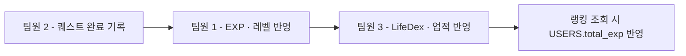

# 06. 역할 분담과 협업 규칙

> 관련 문서: `01-project-plan.md` · `04-api-spec.md` · `05-business-rules.md`

## 1. 분담 원칙

- 기능 단위 세로 분할: 각 팀원이 담당 기능의 화면(UI)·API·데이터베이스·기능 테스트·문서화까지 전 계층을 책임진다.
- 로그인 상태 관리, 공통 디자인, 공통 에러 처리 등 전원이 공유하는 기준은 1주차에 함께 정한다.

## 2. 역할 분담표

| 팀원 | 담당 영역 | 주요 기능 | 주요 화면 | 주요 데이터 |
|---|---|---|---|---|
| 팀원 1 | 회원·프로필·레벨 | 회원가입·로그인·JWT 인증, 마이페이지, 프로필 수정, EXP·레벨 시스템, 레벨업 보상, 칭호·프로필 아이템 획득 | 로그인, 회원가입, 마이페이지, 프로필 편집, 레벨·보상 화면 | USERS, TITLES, USER_TITLES, PROFILE_ITEMS, USER_PROFILE_ITEMS, LEVEL_REWARDS, EXP_LOGS |
| 팀원 2 | 퀘스트·GPS 인증 | 오늘의 퀘스트 제공, 퀘스트 목록·상세·등급, 퀘스트 완료 처리, GPS 현재 위치 확인, 거리 계산, 인증 반경 판정, 지도 표시 | 메인 홈, 오늘의 퀘스트, 퀘스트 상세, GPS 인증, 지도 | QUESTS, USER_DAILY_QUESTS, QUEST_COMPLETIONS |
| 팀원 3 | LifeDex·업적 | 경험 도감(카테고리·진행률·자동 등록), 업적 시스템(단계별·비밀 업적, 조건 확인) | LifeDex 목록·상세, 업적 목록·상세, 비밀 업적 해금 | LIFEDEX_CATEGORIES, LIFEDEX_ITEMS, USER_LIFEDEX, ACHIEVEMENTS, ACHIEVEMENT_STEPS, USER_ACHIEVEMENTS |
| 팀원 4 | 친구·랭킹·관리 | 친구 검색·추가·삭제·목록·프로필 비교, EXP·레벨 랭킹, 관리자 퀘스트 등록·수정, 전체 데이터 통합 확인 | 친구 목록·검색·프로필, 랭킹, 관리자 퀘스트 관리 | FRIEND_REQUESTS, FRIENDSHIPS |

API 목록은 `04-api-spec.md` §3, 데이터 상세는 `03-database-design.md` §2 참조.

## 3. 기능 연결 구조

퀘스트 완료 한 번이 네 담당 영역을 순서대로 거친다.

이 연결 때문에 **퀘스트 완료 API의 응답 형식을 1주차에 반드시 함께 정해야 한다.** 계약 상세: `04-api-spec.md` §4.

## 4. 완료 응답 계약 요약

| 필드 그룹 | 채우는 담당 |
|---|---|
| `completionId`, `dailyQuestId`, `questId`, `grade`, `duplicated`, `location` | 팀원 2 |
| `growth`(EXP, 레벨, 레벨업 보상) | 팀원 1 |
| `collection`(신규 도감, 신규 업적) | 팀원 3 |
| 랭킹 조회(`USERS.total_exp` 직접 조회, 완료 응답 미포함) | 팀원 4 |

전체 스키마: `04-api-spec.md` §4.

완료 기록·EXP·레벨·LifeDex·업적 반영은 팀원 2가 여는 하나의 서버 트랜잭션 안에서 처리한다. 팀원 1·3은 이 트랜잭션에 참여하는 도메인 서비스를 제공하며, 팀원 4의 랭킹은 별도 갱신 없이 `USERS.total_exp`를 조회한다.

이 트랜잭션에 참여하는 도메인 서비스가 예외를 던지면 퀘스트 완료 기록과 EXP 지급까지 함께 롤백되어, 사용자는 퀘스트를 완료하지 못한 것이 된다. 도감·업적 판정 실패가 완료를 막을 사유가 아니라면 각 도메인 서비스 안에서 처리하고 빈 결과를 돌려준다.

`collection`은 `com.lifequest.collection.CollectionService` 인터페이스를 팀원 3이 `@Service` 구현체로 채우는 방식이다. 착수 전까지는 항상 빈 결과를 돌려주는 `PlaceholderCollectionService`가 자리를 지키며, 실구현이 추가되면 빈 후보가 둘이 되어 애플리케이션 컨텍스트 로딩이 실패한다 — 그 실패가 자리표시자를 삭제하라는 신호다. `@Primary`·`@Qualifier` 등으로 예외만 덮으면 자리표시자가 살아남아 도감·업적이 빈 채로 남고, 그 상태는 예외도 로그도 남기지 않는다.

업적 단계 보상(`ACHIEVEMENT_STEPS.reward_title_id`)은 칭호이므로 지급 대상 테이블(`USER_TITLES`)의 소유자는 팀원 1이다. 지급 경로는 둘이고 응답 모양은 어느 쪽이든 같다 — ⓐ 팀원 1이 `RewardService`에 특정 칭호를 지급하는 공개 메서드를 열면 중복 지급 방지와 대표 칭호 자동 설정이 재사용된다. ⓑ `UserTitleRepository`를 직접 사용하면 `UserTitle`이 출처 인자를 이미 받으므로 `"ACHIEVEMENT"`로 저장할 수 있고 스키마 변경이 없으나, 앞의 두 로직은 직접 처리해야 한다.

`QUESTS.lifedex_item_id`는 완료 시 자동 등록될 도감 항목을 가리키지만, `LIFEDEX_ITEMS` 테이블이 아직 없어 외래 키 제약은 보류 상태다(`V4`·`V6` 마이그레이션 주석). 팀원 3이 테이블을 만들 때 제약 추가와 퀘스트 시드 매핑을 함께 정한다.

`QUESTS` 엔티티와 저장소의 소유자는 팀원 2다. 팀원 4의 관리자 기능은 팀원 2가 제공하는 퀘스트 관리 서비스 인터페이스를 호출하며, `QUESTS` 저장 로직을 중복 구현하지 않는다.

## 5. 공통 작업 분담

### 5-1. 시작 단계(전원 공통)

프로젝트 구조 설정 · GitHub 저장소 생성 · 브랜치 규칙 설정 · 공통 UI 디자인 결정 · API 응답 형식 통일 · 데이터베이스 관계 설계 · 공통 에러 처리 방식 결정

### 5-2. 마무리 단계(전원 공통)

기능 통합 · 화면 연결 · 테스트 데이터 생성 · 오류 수정 · 발표 자료 작성 · 시연 시나리오 준비 · 배포

세부 조정 역할(예: GitHub 저장소 관리, 디자인 시스템 정리 등)이 필요하면 진행 중 팀 논의로 담당을 정한다 `[제안]`.

## 6. Git 워크플로

- 브랜치 전략: `main`(배포 가능 상태 유지) · `develop`(통합 브랜치) · `feature/*`(기능 브랜치) `[제안]`
- 브랜치 네이밍: `feature/{담당자}-{기능}` (예: `feature/member2-quest-complete`)
- 커밋 컨벤션: `feat:` 신규 기능 · `fix:` 버그 수정 · `docs:` 문서 · `refactor:` 리팩터링 · `test:` 테스트 · `chore:` 기타
- PR 규칙: 최소 1인 리뷰 승인 후 병합, 셀프 머지 지양
- 코드 리뷰 체크리스트(예시): API 명세와 일치하는가 / 예외 처리가 되어 있는가 / 공통 응답 포맷을 따르는가

## 7. 일정

| 주차 | 전원 공통 | 팀원 1 | 팀원 2 | 팀원 3 | 팀원 4 |
|---|---|---|---|---|---|
| 1주 | 환경 설정, DB·화면 설계, GitHub 저장소·브랜치 규칙 | 로그인 기본 구현 | 퀘스트 기본 데이터 구성 | 도감·업적 데이터 구조 설계 | 배포 환경 초기 설정 |
| 2주 | - | 회원가입·로그인·마이페이지 완성, EXP·레벨 기본 구현 | 오늘의 퀘스트·GPS 인증·완료 처리 완성 | LifeDex·기본 업적 완성 | 친구 요청·목록·랭킹 완성 |
| 3주 | 기능 연결, 화면 완성, 예외 처리, 통합 테스트 | 레벨업 보상·칭호 연동 | 완료 응답 통합, 지도 화면 완성 | 업적 조건 검사, 비밀 업적 연동 | 관리자 퀘스트 관리, 데이터 통합 확인 |
| 4주 | 오류 수정, UI 정리, 배포, 발표·시연 준비 | - | - | - | 최종 배포 |

2주차 종료 시점에는 다음 흐름이 동작해야 한다: 회원가입 → 로그인 → 오늘의 퀘스트 확인 → 퀘스트 완료 → EXP 획득 → 레벨 정보 변경.

## 8. 완료 정의(Definition of Done)

기능 하나가 "완료"로 인정되려면 다음을 모두 만족해야 한다.

- 화면 UI가 명세대로 동작한다
- API 연동이 되어 있다(더미 데이터가 아닌 실제 서버 응답)
- 주요 예외 상황(빈 화면·오류·권한 없음)이 처리되어 있다
- 최소한의 기능 테스트를 통과한다
