# Life Quest — ERD

MVP 범위([PRD](./PRD.md) §6) 테이블. 담당별 도메인(User/Quest/UserQuest · Level/Achievement/LifeDex/Title · Friend/Ranking/Reward/Inventory)을 정규화해 관계와 제약을 명시한다.

> 지역 해금·위치 인증(Region/Location), 보물상자, 시즌/이벤트, 스토리 테이블은 **Phase 2**로 이 ERD에 없음 — [비즈니스 규칙서](./business-rules.md) §11.

```mermaid
%%{init: {'theme':'neutral'}}%%
erDiagram
  USER ||--o{ USER_QUEST : receives
  QUEST ||--o{ USER_QUEST : instanced_as
  QUEST }o--o| LIFEDEX_ITEM : registers

  USER ||--o{ USER_ACHIEVEMENT : progresses
  ACHIEVEMENT ||--o{ USER_ACHIEVEMENT : tracked_by
  USER ||--o{ USER_LIFEDEX : collects
  LIFEDEX_ITEM ||--o{ USER_LIFEDEX : collected_as
  USER ||--o{ USER_TITLE : unlocks
  TITLE ||--o{ USER_TITLE : granted_as

  USER ||--o{ FRIENDSHIP : requests
  USER ||--o{ REWARD_LOG : receives
  USER ||--o{ INVENTORY : owns
  USER ||--o{ RANKING_SNAPSHOT : ranked_in
  LEVEL_REWARD ||--o{ REWARD_LOG : granted_from

  USER {
    bigint id PK
    string email UK
    string password_hash
    string nickname
    int level
    bigint exp
    bigint weekly_exp "주간 랭킹용, 매주 월요일 리셋"
    bigint equipped_title_id FK "nullable — 대표 칭호"
    bigint featured_achievement_id FK "nullable — 대표 업적"
  }
  QUEST {
    bigint id PK
    string title
    string description
    string category "여행|음식|카페|영화|운동 등"
    string tier "COMMON|RARE|EPIC|LEGENDARY"
    int exp_reward
    int min_level "등급 해금 레벨 게이팅"
    bigint lifedex_item_id FK "nullable — 완료 시 등록될 도감 항목"
  }
  USER_QUEST {
    bigint id PK
    bigint user_id FK
    bigint quest_id FK
    date assigned_date
    string status "ASSIGNED|COMPLETED|EXPIRED"
    datetime completed_at "nullable"
    string idempotency_key UK "완료 요청 중복 방지"
  }
  ACHIEVEMENT {
    bigint id PK
    string code UK
    string name
    string category "nullable — 카테고리 연동형이면 지정"
    string tier_thresholds "예: 10,30,100,300,1000 (단일형은 1)"
    boolean hidden "비밀 업적 — MVP는 항상 false"
  }
  USER_ACHIEVEMENT {
    bigint user_id PK_FK
    bigint achievement_id PK_FK
    int progress_count
    int achieved_tier "0=미달성, 1~5=I~V"
  }
  LIFEDEX_ITEM {
    bigint id PK
    string category "여행|음식|카페|영화|운동 등"
    string name "예: 초밥, 마라탕, 혼자 여행"
  }
  USER_LIFEDEX {
    bigint user_id PK_FK
    bigint lifedex_item_id PK_FK
    datetime collected_at
  }
  TITLE {
    bigint id PK
    string code UK
    string name "여행자, 미식가, 카페 마스터 등"
    string unlock_condition "LEVEL:5 | ACHV:CAFE_EXPLORER:3 등"
  }
  USER_TITLE {
    bigint user_id PK_FK
    bigint title_id PK_FK
    datetime unlocked_at
  }
  FRIENDSHIP {
    bigint id PK
    bigint user_id FK "요청자"
    bigint friend_id FK "수신자"
    string status "PENDING|ACCEPTED"
  }
  RANKING_SNAPSHOT {
    bigint id PK
    bigint user_id FK
    date week_start
    bigint weekly_exp
    int rank
  }
  LEVEL_REWARD {
    int level PK "2,5,10,15,20,30"
    string reward_type "BORDER|TITLE|QUEST_UNLOCK|AVATAR|BADGE"
    bigint reward_ref_id "nullable — 아이템/칭호 참조"
  }
  REWARD_LOG {
    bigint id PK
    bigint user_id FK
    string source "LEVEL_UP (Phase 2: TREASURE_CHEST 등)"
    string reward_type
    bigint reward_ref_id
    datetime granted_at
    string idempotency_key UK "레벨업 이벤트당 1회 지급"
  }
  INVENTORY {
    bigint id PK
    bigint user_id FK
    string item_type "BORDER|BACKGROUND|BADGE|AVATAR"
    bigint item_ref_id
    datetime acquired_at
    boolean equipped "슬롯(item_type)별 1개만 true"
  }
```

## 테이블 요약 (담당별)

| 담당 | 테이블 |
|---|---|
| 팀원1 | `USER` |
| 팀원2 | `QUEST`, `USER_QUEST` |
| 팀원3 | `ACHIEVEMENT`, `USER_ACHIEVEMENT`, `LIFEDEX_ITEM`, `USER_LIFEDEX`, `TITLE`, `USER_TITLE`, `LEVEL_REWARD` |
| 팀원4 | `FRIENDSHIP`, `RANKING_SNAPSHOT`, `REWARD_LOG`, `INVENTORY` |

## 제약 조건 요약

- `USER.email` — UNIQUE
- `USER_QUEST` — `(user_id, quest_id, assigned_date)` UNIQUE (동일 유저에게 같은 날 동일 퀘스트 중복 배정 방지), `idempotency_key` UNIQUE (완료 요청 중복 방지 — [비즈니스 규칙서](./business-rules.md) §3)
- `USER_ACHIEVEMENT` — PK = `(user_id, achievement_id)`, `achieved_tier`는 단조 증가([비즈니스 규칙서](./business-rules.md) §7)
- `USER_LIFEDEX` — PK = `(user_id, lifedex_item_id)` (도감 항목은 사용자당 1회만 등록)
- `LIFEDEX_ITEM` — `(category, name)` UNIQUE
- `USER_TITLE` — PK = `(user_id, title_id)`
- `FRIENDSHIP` — `(user_id, friend_id)` UNIQUE, `user_id ≠ friend_id` (역방향 중복 요청은 애플리케이션에서 검사 `[TBD: 정규화 방식]`)
- `RANKING_SNAPSHOT` — `(user_id, week_start)` UNIQUE
- `REWARD_LOG.idempotency_key` — UNIQUE (레벨업 보상 중복 지급 방지)
- `INVENTORY` — `(user_id, item_type, item_ref_id)` UNIQUE, 같은 `(user_id, item_type)`에서 `equipped=true`는 최대 1행(애플리케이션 보장)
- `QUEST.lifedex_item_id` — nullable FK (도감 연동 퀘스트만 값 존재)
