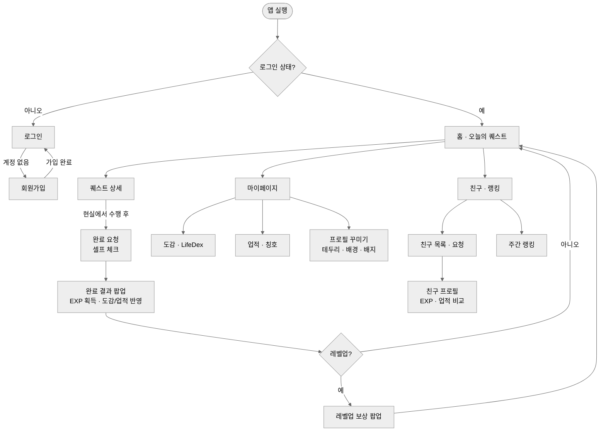

# Life Quest — 화면 흐름도

로그인부터 퀘스트 완료까지 사용자 이동 경로. 화면별 상세는 [화면 명세서](./screen-spec.md), 규칙은 [비즈니스 규칙서](./business-rules.md) 참조.

서비스 이용 흐름(기획서 §8): 회원가입 → 로그인 → 오늘의 퀘스트 확인 → 현실에서 퀘스트 수행 → 인증 및 완료 → EXP 획득 → 레벨업 → 보상 획득 → 도감 등록 → 업적 달성 → 새로운 콘텐츠 해금 → 반복.

> Phase 2에서 추가되는 경로: 지도·GPS 인증(위치 퀘스트), 보물상자 팝업, 시즌/이벤트 배너, 스토리 챕터 — [PRD](./PRD.md) §6-1.

## 화면 목록 (담당)

| 화면 | 담당 | 비고 |
|---|---|---|
| 로그인 / 회원가입 | 팀원1 | JWT 발급·저장 |
| 홈 · 오늘의 퀘스트 | 팀원1 | 매일 배정 목록 |
| 퀘스트 상세 | 팀원1 | 완료 진입점 |
| 완료 결과 / 레벨업 보상 팝업 | 팀원2 · 팀원3 | 완료 API 응답 기반(추가 호출 없음) |
| 도감(LifeDex) | 팀원3 | 카테고리 > 항목 2단 |
| 업적 · 칭호 | 팀원3 | 단계형(I~V) 진행도 |
| 마이페이지 · 프로필 꾸미기 | 팀원4 | 인벤토리 장착 |
| 친구 목록 · 랭킹 · 친구 프로필 | 팀원4 | 주간 EXP 랭킹 |
