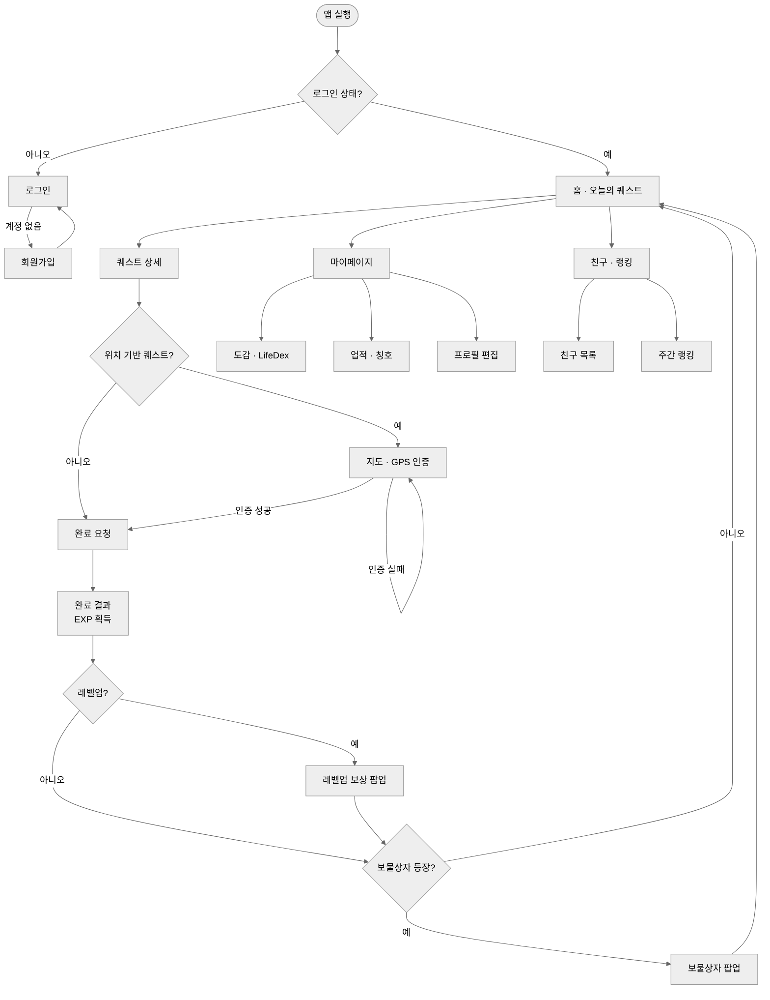

# Life Quest — 화면 흐름도

로그인부터 퀘스트 완료까지 사용자 이동 경로. 화면별 상세는 [화면 명세서](./screen-spec.md), 규칙은 [비즈니스 규칙서](./business-rules.md) 참조.

## 화면 목록 (담당)

| 화면 | 담당 | 비고 |
|---|---|---|
| 로그인 / 회원가입 | 팀원1 | |
| 홈 · 오늘의 퀘스트 | 팀원1 | |
| 퀘스트 상세 | 팀원1 | |
| 지도 · GPS 인증 | 팀원2 | 위치 퀘스트만 진입 |
| 완료 결과 / 레벨업 보상 / 보물상자 팝업 | 팀원3 · 팀원4 | 완료 API 응답 기반 |
| 도감(LifeDex) | 팀원3 | |
| 업적 · 칭호 | 팀원3 | |
| 프로필 | 팀원4 | |
| 친구 목록 · 랭킹 | 팀원4 | |
